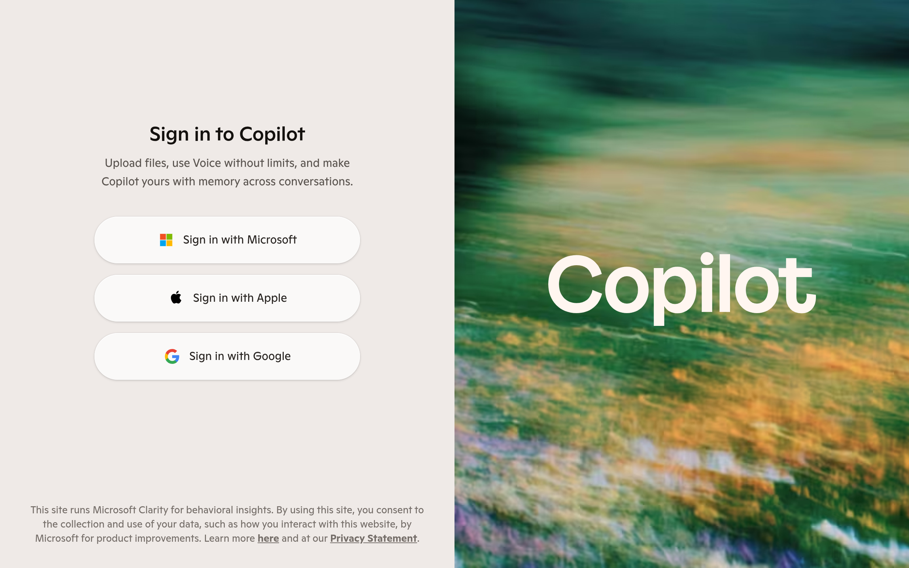

# copilot Design System

You are building UI for **copilot**. Dark-themed, warm palette, sans-serif typography (GintoNord), compact density on a 4px grid, flat elevation (no shadows), expressive motion.

## Visual Reference

**IMPORTANT**: Study ALL screenshots below before writing any UI. Match colors, typography, spacing, layout, and motion exactly as shown.

### Homepage



> Read `references/DESIGN.md` for full token details.

## Design Philosophy

- **Flat elevation** — depth through color shifts and borders, never shadows. Surfaces get progressively lighter to indicate elevation.
- **Gradient accents** — gradients are used thoughtfully for emphasis, not decoration.
- **Type pairing** — GintoNord for body/UI text, Ginto for headings/display. Never introduce a third typeface.
- **compact density** — 4px base grid. Every dimension is a multiple of 4.
- **warm palette** — the color temperature runs warm, matching the sans-serif typography.
- **Restrained accent** — `#ffb4ad` is the only pop of color. Used exclusively for CTAs, links, focus rings, and active states.
- **Expressive motion** — animations are an integral part of the experience. Use spring physics and layout animations.

## Color System

### Core Palette

| Role | Token | Hex | Use |
|------|-------|-----|-----|
| Background | `--background` | `#000000` | Page/app background |
| Surface | `--surface` | `#1c2437` | Cards, panels, modals |
| Text Primary | `--text-primary` | `#ffffff` | Headings, body text |
| Text Muted | `--text-muted` | `#323f60` | Captions, placeholders |
| Accent | `--accent` | `#ffb4ad` | CTAs, links, focus rings |
| Border | `--border` | `#3b3b3b` | Dividers, card borders |

### Status Colors

| Status | Hex | Use |
|--------|-----|-----|
| Success | `#01712b` | Confirmations, positive trends |
| Warning | `#f3c357` | Caution states, pending items |
| Danger | `#ac1922` | Errors, destructive actions |

### Extended Palette

- `#c7c7c7`
- `#f2f2f2` — Light surface or highlight color
- `#262626`
- `#f98880`
- `#e5ebfa` — Light surface or highlight color
- `#97abea`
- `#121212` — Deep background layer or shadow color
- `#6cc57b`

### CSS Variable Tokens

```css
--editorial-card-layout: portrait;
--color-app-background-100: transparent;
--color-accent-100: var(--color-caramel-100);
--color-accent-150: var(--color-caramel-150);
--color-accent-200: var(--color-caramel-200);
--color-accent-250: var(--color-caramel-250);
--color-accent-300: var(--color-caramel-300);
--color-accent-350: var(--color-caramel-350);
--color-accent-400: var(--color-caramel-400);
--color-accent-450: var(--color-caramel-450);
--color-accent-550: var(--color-caramel-550);
--color-accent-600: var(--color-caramel-600);
--color-accent-650: var(--color-caramel-650);
--color-accent-700: var(--color-caramel-700);
--color-accent-750: var(--color-caramel-750);
--color-accent-800: var(--color-caramel-800);
--color-accent-850: var(--color-caramel-850);
--color-accent-900: var(--color-caramel-900);
--color-accent-static-100: var(--color-caramel-100);
--color-accent-static-150: var(--color-caramel-150);
```

## Typography

### Font Stack

- **GintoNord** — Heading 1, Heading 2, Heading 3
- **Ginto** — Body, Caption

### Font Sources

```css
@font-face {
  font-family: "Ginto";
  src: url("fonts/Ginto-Regular.woff2") format("woff2");
  font-weight: 400;
}
@font-face {
  font-family: "GintoNord";
  src: url("fonts/GintoNord-Regular.woff2") format("woff2");
  font-weight: 400;
}
@font-face {
  font-family: "CascadiaCode";
  src: url("fonts/CascadiaCode-Regular.woff2") format("woff2");
  font-weight: 400;
}
@font-face {
  font-family: "Georgia Pro";
  src: url("fonts/GeorgiaPro-Regular.woff2") format("woff2");
  font-weight: 400;
}
@font-face {
  font-family: "Georgia Pro";
  src: url("fonts/GeorgiaPro-700.woff2") format("woff2");
  font-weight: 700;
}
```

### Type Scale

| Role | Family | Size | Weight |
|------|--------|------|--------|
| Heading 1 | GintoNord | 80px | 700 |
| Heading 2 | GintoNord | 60px | 700 |
| Heading 3 | GintoNord | 52px | 700 |
| Body | Ginto | .875rem | 400 |
| Caption | Ginto | 1.25rem | 400 |

### Typography Rules

- Body/UI: **GintoNord**, Headings: **Ginto** — these are the only display fonts
- Max 3-4 font sizes per screen
- Headings: weight 600-700, body: weight 400
- Use color and opacity for text hierarchy, not additional font sizes
- Line height: 1.5 for body, 1.2 for headings

## Spacing & Layout

### Base Grid: 4px

Every dimension (margin, padding, gap, width, height) must be a multiple of **4px**.

### Spacing Scale

`2, 4, 6, 8, 10, 12, 14, 16, 18, 20, 22, 24` px

### Spacing as Meaning

| Spacing | Use |
|---------|-----|
| 4-8px | Tight: related items (icon + label, avatar + name) |
| 12-16px | Medium: between groups within a section |
| 24-32px | Wide: between distinct sections |
| 48px+ | Vast: major page section breaks |

### Border Radius

Scale: `.125rem, .25rem, .375rem, .5rem, .625rem, .75rem, 1rem, 1px, 1.25rem, 1.5rem, 1.75rem, 2rem, 2.25rem, 3rem, 4rem, 4px, 7px, 8px, 8.5px, 10px, 12px, 14px, 16px, 18px, 20px, 20%, 24px, 26px, 28px, 32px, 36px, 40px, 48px, 60px, inherit`
Default: `8px`

### Container

Max-width: `1060px`, centered with auto margins.

### Breakpoints

| Name | Value |
|------|-------|
| sm | 32rem |
| xs | 360px |
| xs | 400px |
| xs | 480px |
| sm | 600px |
| sm | 640px |
| md | 768px |
| lg | 960px |
| lg | 1024px |
| xl | 1058px |
| xl | 1280px |
| 2xl | 1380px |
| 2xl | 1536px |
| 2xl | 1920px |

Mobile-first: design for small screens, layer on responsive overrides.

## Component Patterns

### Card

```css
.card {
  background: #1c2437;
  border: 1px solid #3b3b3b;
  border-radius: 8px;
  padding: 16px;
}
```

```html
<div class="card">
  <h3>Card Title</h3>
  <p>Card content goes here.</p>
</div>
```

### Button

```css
/* Primary */
.btn-primary {
  background: #ffb4ad;
  color: #ffffff;
  border-radius: 8px;
  padding: 8px 16px;
  font-weight: 500;
  transition: opacity 150ms ease;
}
.btn-primary:hover { opacity: 0.9; }

/* Ghost */
.btn-ghost {
  background: transparent;
  border: 1px solid #3b3b3b;
  color: #ffffff;
  border-radius: 8px;
  padding: 8px 16px;
}
```

```html
<button class="btn-primary">Get Started</button>
<button class="btn-ghost">Learn More</button>
```

### Input

```css
.input {
  background: #000000;
  border: 1px solid #3b3b3b;
  border-radius: 8px;
  padding: 8px 12px;
  color: #ffffff;
  font-size: 14px;
}
.input:focus { border-color: #ffb4ad; outline: none; }
```

```html
<input class="input" type="text" placeholder="Search..." />
```

### Badge / Chip

```css
.badge {
  display: inline-flex;
  align-items: center;
  padding: 4px 8px;
  border-radius: 9999px;
  font-size: 12px;
  font-weight: 500;
  background: #1c2437;
  color: #323f60;
}
```

```html
<span class="badge">New</span>
<span class="badge">Beta</span>
```

### Modal / Dialog

```css
.modal-backdrop { background: rgba(0, 0, 0, 0.6); }
.modal {
  background: #1c2437;
  border: 1px solid #3b3b3b;
  border-radius: inherit;
  padding: 24px;
  max-width: 480px;
  width: 90vw;
}
```

```html
<div class="modal-backdrop">
  <div class="modal">
    <h2>Dialog Title</h2>
    <p>Dialog content.</p>
    <button class="btn-primary">Confirm</button>
    <button class="btn-ghost">Cancel</button>
  </div>
</div>
```

### Table

```css
.table { width: 100%; border-collapse: collapse; }
.table th {
  text-align: left;
  padding: 8px 12px;
  font-weight: 500;
  font-size: 12px;
  color: #323f60;
  text-transform: uppercase;
  letter-spacing: 0.05em;
  border-bottom: 1px solid #3b3b3b;
}
.table td {
  padding: 12px;
  border-bottom: 1px solid #3b3b3b;
}
```

```html
<table class="table">
  <thead><tr><th>Name</th><th>Status</th><th>Date</th></tr></thead>
  <tbody>
    <tr><td>Item One</td><td>Active</td><td>Jan 1</td></tr>
    <tr><td>Item Two</td><td>Pending</td><td>Jan 2</td></tr>
  </tbody>
</table>
```

### Navigation

```css
.nav {
  display: flex;
  align-items: center;
  gap: 8px;
  padding: 12px 16px;
  border-bottom: 1px solid #3b3b3b;
}
.nav-link {
  color: #323f60;
  padding: 8px 12px;
  border-radius: 8px;
  transition: color 150ms;
}
.nav-link:hover { color: #ffffff; }
.nav-link.active { color: #ffb4ad; }
```

```html
<nav class="nav">
  <a href="/" class="nav-link active">Home</a>
  <a href="/about" class="nav-link">About</a>
  <a href="/pricing" class="nav-link">Pricing</a>
  <button class="btn-primary" style="margin-left: auto">Get Started</button>
</nav>
```

### Extracted Components

These components were found in the codebase:

**Button** (`html`)

## Page Structure

The following page sections were detected:

- **Navigation** — Top navigation bar (4 items)
- **Hero** — Hero section (detected from heading structure)
- **Footer** — Page footer with links and info

When building pages, follow this section order and structure.

## Animation & Motion

This project uses **expressive motion**. Animations are part of the design language.

### CSS Animations

- `scroll-fade`
- `scroll-fade-x-end`
- `bounce-in`
- `shimmer`
- `caret-blink`

### Motion Tokens

- **Duration scale:** `0s`, `.1s`, `.15s`, `.2s`, `.3s`, `.4s`, `.5s`, `.7s`, `.75s`, `1ms`, `1s`
- **Easing functions:** `cubic-bezier(.06,.17,.36,1.26)`, `cubic-bezier(.69,.28,.37,1.87)`, `cubic-bezier(.4,0,.2,1)`, `cubic-bezier(.33,0,0,1)`, `ease`, `cubic-bezier(0,0,0,1)`, `cubic-bezier(.4,0,1,1)`, `linear`, `cubic-bezier(0,0,.2,1)`

### Motion Guidelines

- **Duration:** Use values from the duration scale above. Short (0s) for micro-interactions, long (1s) for page transitions
- **Easing:** Use `cubic-bezier(.06,.17,.36,1.26)` as the default easing curve
- **Direction:** Elements enter from bottom/right, exit to top/left
- **Reduced motion:** Always respect `prefers-reduced-motion` — disable animations when set

## Depth & Elevation

This design uses **flat elevation** — no box-shadows anywhere.

### Elevation Strategy

| Level | Technique | Use |
|-------|-----------|-----|
| 0 — Base | Background color | Page background |
| 1 — Raised | Lighter surface + subtle border | Cards, panels |
| 2 — Floating | Even lighter surface + stronger border | Dropdowns, popovers |
| 3 — Overlay | Backdrop + modal surface | Modals, dialogs |

### Z-Index Scale

`0, 1, 5, 10, 20, 30, 35, 40, 50, 60, 70, 80, 100`

Use these exact values — never invent z-index values.

## Anti-Patterns (Never Do)

- **No box-shadow** on any element — use borders and surface colors for depth
- **No blur effects** — no backdrop-blur, no filter: blur()
- **No zebra striping** — tables and lists use borders for separation
- **No invented colors** — every hex value must come from the palette above
- **No arbitrary spacing** — every dimension is a multiple of 4px
- **No extra fonts** — only GintoNord and Ginto are allowed
- **No arbitrary border-radius** — use the scale: .125rem, .25rem, .375rem, .5rem, .625rem, .75rem, 1rem, 1px, 1.25rem, 1.5rem
- **No opacity for disabled states** — use muted colors instead

## Workflow

1. **Read** `references/DESIGN.md` before writing any UI code
2. **Pick colors** from the Color System section — never invent new ones
3. **Set typography** — GintoNord, Ginto only, using the type scale
4. **Build layout** on the 4px grid — check every margin, padding, gap
5. **Match components** to patterns above before creating new ones
6. **Apply elevation** — flat, surface color shifts only
7. **Validate** — every value traces back to a design token. No magic numbers.

## Brand Spec

- **Favicon:** `/static/cmc/favicon.ico`
- **Site URL:** `https://copilot.microsoft.com`
- **Brand color:** `#ffb4ad`
- **Brand typeface:** GintoNord

## Quick Reference

```
Background:     #000000
Surface:        #1c2437
Text:           #ffffff / #323f60
Accent:         #ffb4ad
Border:         #3b3b3b
Font:           GintoNord
Spacing:        4px grid
Radius:         8px
Components:     7 detected
```

## When to Trigger

Activate this skill when:
- Creating new components, pages, or visual elements for copilot
- Writing CSS, Tailwind classes, styled-components, or inline styles
- Building page layouts, templates, or responsive designs
- Reviewing UI code for design consistency
- The user mentions "copilot" design, style, UI, or theme
- Generating mockups, wireframes, or visual prototypes

---

# Full Reference Files

> Every output file is embedded below. Claude has full design system context from /skills alone.

## Design System Tokens (DESIGN.md)

# copilot DESIGN.md

> Auto-generated design system — reverse-engineered via static analysis by skillui.
> Frameworks: None detected
> Colors: 20 · Fonts: 2 · Components: 7
> Icon library: not detected · State: not detected
> Primary theme: dark · Dark mode toggle: no · Motion: expressive

## Visual Reference

**Match this design exactly** — study colors, fonts, spacing, and component shapes before writing any UI code.


---

## 1. Visual Theme & Atmosphere

This is a **dark-themed** interface with a flat, warm visual language. Elevation is achieved through color and border shifts rather than shadows — a clean, industrial aesthetic. Typography pairs **Ginto** for display/headings with **GintoNord** for body text, creating clear visual hierarchy through type contrast. Spacing follows a **4px base grid** (compact density), with scale: 2, 4, 6, 8, 10, 12, 14, 16px. The accent color **#ffb4ad** anchors interactive elements (buttons, links, focus rings). Motion is expressive — spring physics, layout animations, and staggered reveals are part of the visual language.

---

## 2. Color Palette & Roles

| Token | Hex | Role | Use |
|---|---|---|---|
| tw-ring-color | `#000000` | background | Page background, darkest surface |
| surface | `#1c2437` | surface | Card and panel backgrounds |
| tw-ring-offset-color | `#ffffff` | text-primary | Headings and body text |
| text-muted | `#323f60` | text-muted | Captions, placeholders, secondary info |
| border | `#3b3b3b` | border | Dividers, card borders, outlines |
| accent | `#ffb4ad` | accent | CTAs, links, focus rings, active states |
| tw-ring-color | `#ac1922` | danger | Error states, destructive actions |
| success | `#01712b` | success | Success states, positive indicators |
| warning | `#f3c357` | warning | Warning states, caution indicators |
| info | `#e5ebfa` | info | Informational highlights |
| unknown | `#c7c7c7` | unknown | Palette color |
| unknown | `#f2f2f2` | unknown | Palette color |
| unknown | `#262626` | unknown | Palette color |
| unknown | `#f98880` | unknown | Palette color |
| unknown | `#97abea` | unknown | Palette color |
| unknown | `#121212` | unknown | Palette color |
| unknown | `#6cc57b` | unknown | Palette color |
| unknown | `#9da8d9` | unknown | Palette color |
| unknown | `#333a4e` | unknown | Palette color |
| unknown | `#9d1920` | unknown | Palette color |

### CSS Variable Tokens

```css
--tw-border-spacing-x: 0;
--tw-border-spacing-y: 0;
--tw-border-spacing-x: 0;
--tw-border-spacing-y: 0;
--tw-border-spacing-x: 0px;
--tw-border-spacing-y: 0px;
--tw-border-opacity: 1;
--tw-border-opacity: 1;
--tw-border-spacing-x: 0px;
--tw-border-spacing-y: 0px;
--tw-border-opacity: 1;
--tw-border-opacity: 1;
--tw-border-opacity: 1;
--tw-border-opacity: 1;
--tw-border-opacity: 1;
--tw-border-opacity: 1;
--tw-border-opacity: 1;
--tw-border-opacity: 1;
--tw-border-opacity: 1;
--tw-border-opacity: 1;
```


---

## 3. Typography Rules

**Font Stack:**
- **GintoNord** — Heading 1, Heading 2, Heading 3
- **Ginto** — Body, Caption

**Font Sources:**

```css
@font-face {
  font-family: "Ginto";
  src: url("fonts/Ginto-Regular.woff2") format("woff2");
  font-weight: 400;
}
@font-face {
  font-family: "GintoNord";
  src: url("fonts/GintoNord-Regular.woff2") format("woff2");
  font-weight: 400;
}
@font-face {
  font-family: "CascadiaCode";
  src: url("fonts/CascadiaCode-Regular.woff2") format("woff2");
  font-weight: 400;
}
@font-face {
  font-family: "Georgia Pro";
  src: url("fonts/GeorgiaPro-Regular.woff2") format("woff2");
  font-weight: 400;
}
@font-face {
  font-family: "Georgia Pro";
  src: url("fonts/GeorgiaPro-700.woff2") format("woff2");
  font-weight: 700;
}
```

| Role | Font | Size | Weight |
|---|---|---|---|
| Heading 1 | GintoNord | 80px | 700 |
| Heading 2 | GintoNord | 60px | 700 |
| Heading 3 | GintoNord | 52px | 700 |
| Body | Ginto | .875rem | 400 |
| Caption | Ginto | 1.25rem | 400 |

**Typographic Rules:**
- Limit to 2 font families max per screen
- Use **GintoNord** for body/UI text, **Ginto** for display/headings
- Maintain consistent hierarchy: no more than 3-4 font sizes per screen
- Headings use bold (600-700), body uses regular (400)
- Line height: 1.5 for body text, 1.2 for headings
- Use color and opacity for secondary hierarchy, not additional font sizes


---

## 4. Component Stylings

### Layout (1)

**Footer** — `html`

### Navigation (1)

**Navigation** — `html`

### Data Display (1)

**List** — `html`

### Data Input (2)

**Button** — `html`

**Input** — `html`
- State: :focus, :placeholder

### Media (2)

**Image** — `html`

**Icon** — `html`


---

## 5. Layout Principles

- **Base spacing unit:** 4px
- **Spacing scale:** 2, 4, 6, 8, 10, 12, 14, 16, 18, 20, 22, 24
- **Border radius:** .125rem, .25rem, .375rem, .5rem, .625rem, .75rem, 1rem, 1px, 1.25rem, 1.5rem, 1.75rem, 2rem, 2.25rem, 3rem, 4rem, 4px, 7px, 8px, 8.5px, 10px, 12px, 14px, 16px, 18px, 20px, 20%, 24px, 26px, 28px, 32px, 36px, 40px, 48px, 60px, inherit
- **Max content width:** 1060px

**Spacing as Meaning:**
| Spacing | Use |
|---|---|
| 4-8px | Tight: related items within a group |
| 12-16px | Medium: between groups |
| 24-32px | Wide: between sections |
| 48px+ | Vast: major section breaks |


---

## 6. Depth & Elevation

No box-shadow values detected. The design uses a **flat visual style** — elevation is conveyed through background color shifts and borders rather than shadows.

**Elevation Strategy:**
| Level | Technique | Use |
|---|---|---|
| 0 — Base | Background color | Page background |
| 1 — Raised | Lighter surface + subtle border | Cards, panels |
| 2 — Floating | Even lighter surface + stronger border | Dropdowns, popovers |
| 3 — Overlay | Backdrop + modal surface | Modals, dialogs |

**Z-Index Scale:** `0, 1, 5, 10, 20, 30, 35, 40, 50, 60, 70, 80, 100`


---

## 7. Animation & Motion

This project uses **expressive motion**. Animations are an integral part of the experience.

### CSS Animations

- `@keyframes scroll-fade`
- `@keyframes scroll-fade-x-end`
- `@keyframes bounce-in`
- `@keyframes shimmer`
- `@keyframes caret-blink`
- `@keyframes dotBounce`
- `@keyframes dotPulse`
- `@keyframes fade-in`

### Motion Guidelines

- Duration: 150-300ms for micro-interactions, 300-500ms for page transitions
- Easing: `ease-out` for enters, `ease-in` for exits
- Always respect `prefers-reduced-motion`


---

## 8. Do's and Don'ts

### Do's

- Use `#ffb4ad` for interactive elements (buttons, links, focus rings)
- Use `#000000` as the primary page background
- Pair **GintoNord** (body) with **Ginto** (display) — these are the only allowed fonts
- Follow the **4px** spacing grid for all margins, padding, and gaps
- Use border and background shifts for elevation — not shadows
- Use border-radius from the scale: .125rem, .25rem, .375rem, .5rem, .625rem
- Reuse existing components from Section 4 before creating new ones

### Don'ts

- Don't introduce colors outside this palette — extend the design tokens first
- Don't introduce additional font families beyond GintoNord and Ginto
- Don't use arbitrary spacing values — stick to multiples of 4px
- Don't add box-shadow — this design system uses flat elevation
- Don't use arbitrary border-radius values — pick from the defined scale
- Don't duplicate component patterns — check Section 4 first
- Don't use backdrop-blur or blur effects

### Anti-Patterns (detected from codebase)

- No box-shadow on any element
- No blur or backdrop-blur effects
- No zebra striping on tables/lists


---

## 9. Responsive Behavior

| Name | Value | Source |
|---|---|---|
| sm | 32rem | css |
| xs | 360px | css |
| xs | 400px | css |
| xs | 480px | css |
| sm | 600px | css |
| sm | 640px | css |
| md | 768px | css |
| lg | 960px | css |
| lg | 1024px | css |
| xl | 1058px | css |
| xl | 1280px | css |
| 2xl | 1380px | css |
| 2xl | 1536px | css |
| 2xl | 1920px | css |

**Approach:** Use `@media (min-width: ...)` queries matching the breakpoints above.


---

## 10. Agent Prompt Guide

Use these as starting points when building new UI:

### Build a Card

```
Background: #1c2437
Border: 1px solid #3b3b3b
Radius: 8px
Padding: 16px
Font: GintoNord
No shadows — use borders and surface colors for depth.
```

### Build a Button

```
Primary: bg #ffb4ad, text white
Ghost: bg transparent, border #3b3b3b
Padding: 8px 16px
Radius: 8px
Hover: opacity 0.9 or lighter shade
Focus: ring with #ffb4ad
```

### Build a Page Layout

```
Background: #000000
Max-width: 1060px, centered
Grid: 4px base
Responsive: mobile-first, breakpoints from Section 9
```

### Build a Stats Card

```
Surface: #1c2437
Label: #323f60 (muted, 12px, uppercase)
Value: #ffffff (primary, 24-32px, bold)
Status: use success/warning/danger from Section 2
```

### Build a Form

```
Input bg: #000000
Input border: 1px solid #3b3b3b
Focus: border-color #ffb4ad
Label: #323f60 12px
Spacing: 16px between fields
Radius: 8px
```

### General Component

```
1. Read DESIGN.md Sections 2-6 for tokens
2. Colors: only from palette
3. Font: GintoNord, type scale from Section 3
4. Spacing: 4px grid
5. Components: match patterns from Section 4
6. Elevation: flat, surface shifts
```

## Bundled Fonts (fonts/)

The following font files are bundled in the `fonts/` directory:

- `fonts/CascadiaCode-Regular.ttf`
- `fonts/CascadiaCode-Regular.woff2`
- `fonts/GeorgiaPro-700.woff2`
- `fonts/GeorgiaPro-Regular.woff2`
- `fonts/Ginto-Regular.ttf`
- `fonts/Ginto-Regular.woff`
- `fonts/Ginto-Regular.woff2`
- `fonts/GintoNord-Regular.ttf`
- `fonts/GintoNord-Regular.woff`
- `fonts/GintoNord-Regular.woff2`

Use these local font files in `@font-face` declarations instead of fetching from Google Fonts.

## Homepage Screenshots (screenshots/)


